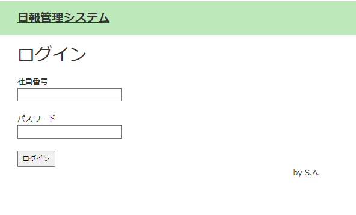
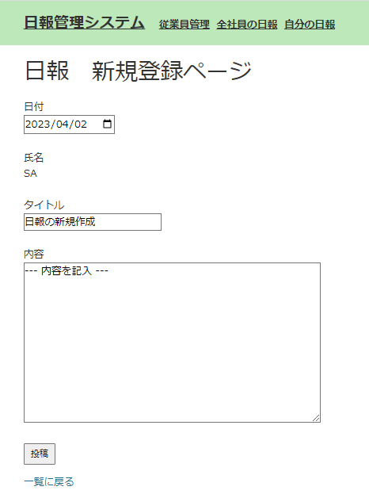
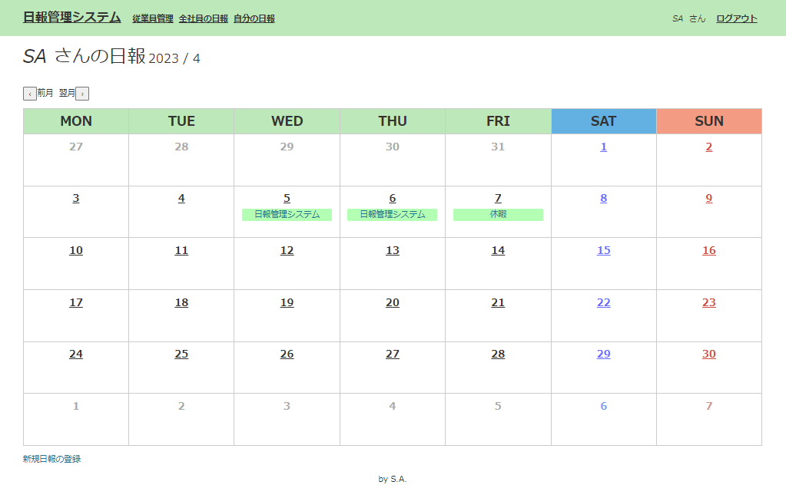
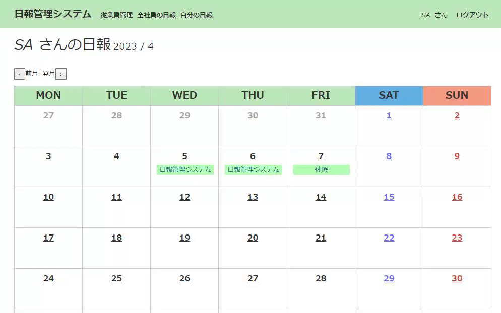

# daily_report_system
# Name
 
”daily_report_system" is a program for managing daily reports with Java.

# DEMO
* You can write your daily report. 
* You can read all employees' daily report. 
* You can manage an employee information.(administrator only) 
### Login page

### Create a report page

### Top page

# Features
Your reports are listed on a calender.  
Click report title on a calender and you'll jump to the detail page.

 
# Requirement

# Installation

# Usage

# Note

# Author

S.Akiyama

# License
